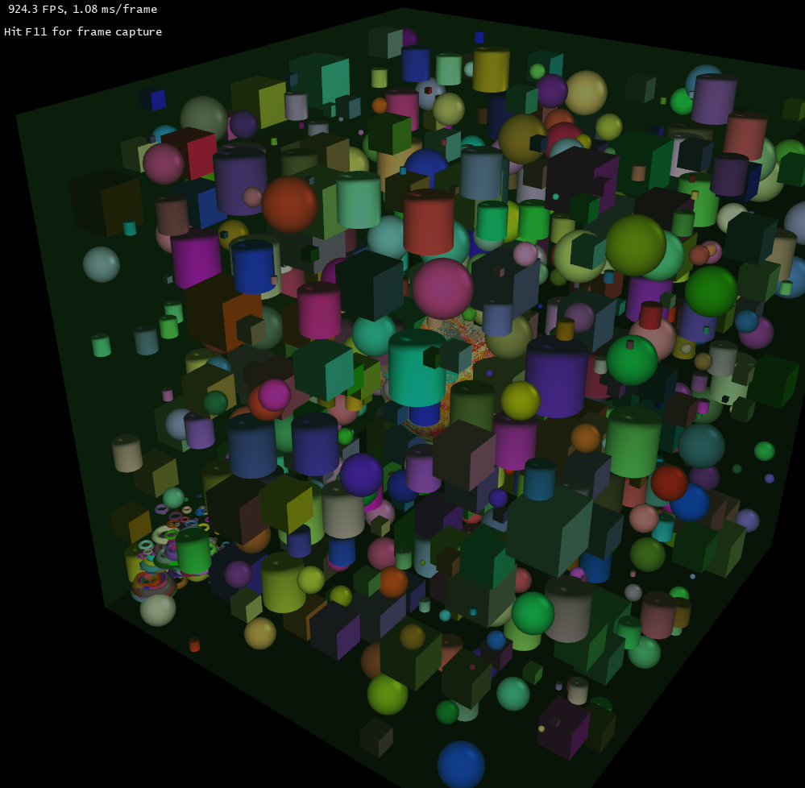

# OpenGL Graphics Project
## About
This project is a 3D Object Collision Demo developed using OpenGL, showcasing real-time collision detection and response between objects in a 3D environment. The demo simulates basic physics principles such as velocity and acceleration, allowing objects to interact upon impact. It employs shaders for lighting and surface effects, enhancing the visual quality of the scene. The project utilizes collision detection algorithms, including bounding volumes, to manage interactions between objects effectively.

This project was a 3D Object Collision Demo developed using OpenGL as part of a university Graphics course. It simulates real-time collision detection between objects in a 3D space, applying basic physics principles like velocity, acceleration, and object interaction upon impact. The project also incorporates shaders to handle lighting and surface effects, which enhance the visual representation of the scene. By using collision algorithms like bounding volumes, this demo demonstrates how collisions are managed in 3D environments. The project provided valuable experience in both collision detection and shader programming, essential for modern graphics and game development.
It's been overhauled to include a more modular architecture with an abstract Renderer class, allowing for easier integration of different rendering backends. The OpenGLRenderer implementation has been improved, and a SlangCompiler has been introduced to streamline shader management across multiple graphics APIs. The codebase has been modernized to utilize contemporary C++ features and OpenGL practices, enhancing performance and maintainability.
## Installation

*For the Win32 [Release](https://github.com/uminode/CollisionEngine/releases/tag/v2025_11_27_win64)*

If your system isn't on Win32, follow the build instructions.

## Build
To build the **3D Object Collision Demo**, follow these steps:

For the latest edition, you'll have to build the solution by:

1. **Clone the Repository**:

    ```bash
    git clone https://github.com/uminode/Lab1-Graphics.git
    ```

2. **Open the Solution in Visual Studio**:
    - Navigate to the project folder.
    - Open the `.sln` file in Visual Studio.

3. **Add Dependencies**:
    - Dependencies are located in the `dependencies` folder.
    - Detailed instructions for adding them to the project can be found in the `dependencies/README.txt` file.

4. **Build and Run**:
    - Once the dependencies are set up, build the project by selecting **Build > Build Solution**.
    - If the build succeeds, run the demo by pressing **F5** or selecting **Debug > Start Debugging**.
## Execution Instructions

Once you run the demo, the program will open in the 3D scene. You can move around the scene, spawn small random shapes, and observe the collisions between the objects in real-time. Use the controls below to navigate and interact with the scene.

### Player Controls

| Action              | Control Key    |
|---------------------|:--------------:|
| **Move** Forward    | `W`            |
| **Move** Backward   | `S`            |
| **Move** Left       | `A`            |
| **Move** Right      | `D`            |
| **Move** Up         | `E`            |
| **Move** down       | `X`            |
| **Rotate** Right    | `L`            |
| **Rotate** Left     | `J`            |
| **Rotate** Up       | `I`            |
| **Rotate** Down     | `K`            |


### Sphere Controls
| Action                 | Control Key    |
|------------------------|:--------------:|
| **Move** Up (+Y)       | `Up Arrow`     |
| **Move** Down (-Y)     | `Down Arrow`   |
| **Move** Left (+X)     | `Left Arrow`   |
| **Move** Right (-X)    | `Right Arrow`  |
| **Move** Forward (+Z)  | `Up Arrow`     |
| **Move** Backwards (-Z)| `Down Arrow`   |
| **Toggle** Texture     | `T`            |


### Game Controls
| Action                 | Control Key    |
|------------------------|:--------------:|
| **Spawn** Random Shape | `Space`        |
| **Decrease** Speed     | `<`            |
| **Increase** Speed     | `>`            |
| **Mute** Sounds        | `M`            |
| **Exit**               | `Esc`          |

**TODO**: 

	- IMPORTANT: migrate to CMake for cross-platform compatibility
		-- Check the CMakeLists.txt file for progress.
		-- use StamatisMat/DX12Test3 as template for D3D12 and slang CMake dependencies.
		-- vulkan SDK by lunarg contains vulkan, slang, spirv-cross, spirv and glm.
		-- Figure out glfw3, glew/glad download.
	- Update Dependencies (use CMake TODO for this. Solve two problems with one solution)
		-- figure out how to include spirv-cross without getting the user to compile the project themselves. CMake to the rescue?
			--- vulkan SDK by lunarg contains vulkan, slang, spirv-cross, spirv and glm. Use that in CMake.
			--- use StamatisMat/DX12Test3 as template for D3D12 CMake dependencies.
	- Implement more renderers:
		-- VulkanRenderer implements Renderer
		-- DX12Renderer implements Renderer
	- Modernize code
		-- put code in src folder, dependencies in include, lib, bin folders. Remove slnx file and vcxproj file as they're platform specific.
		-- Utilize modern OpenGL (Direct State Access)
			-- setupDebugMessenger() to match Vulkan structure
		-- Utilize modern C++ features (RAII, coroutines?)
		-- Utilize dynamic link libraries instead of a monolithic exe
	- Fix InputController for Windows 11

DONE:

	- Modernize current render process. Utilize batch rendering techniques. Figure out how to store data in SSBOs. \/
		-- Implemented batch rendering for static and dynamic objects. Reduced draw calls significantly. It's bonkers. Check \/
	- Abstract Renderer class
		-- OpenGLRenderer implements Renderer
	- SlangCompiler
		-- Find a way to have the same shader utilized for all solutions(SLang).
			--- Debug ShaderCompiler
			--- Utilize SpirV shaders in OpenGL. Compare SpirV results by compiling GLSL to SpirV and slang to SpirV. \/
	- Removed every shader reference from ApplicationController. All shader commands are in OpenGLShader
	- Removed uniform variables and replaced them with Uniform Buffers.	-	

